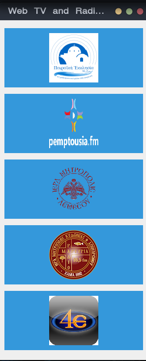

# orthodox_web-media
Christian Greek Orthodox web media app (using vlc)



### Required
`vlc`

### Installation
```
mkdir -p /usr/share/{orthodox_web-media,applications}
cp *.png *jpg /usr/share/orthodox_web-media/
cp orthodox_web-media.desktop /usr/share/applications/orthodox_web-media.desktop
cp orthodox_media.py /opt/orthodox_media.py
```
Slackware user just run SlackBuild ;) 
### USE
Form terminal command:
`python3 /opt/orthodox_media.py` <br>
or click the icon <br>
