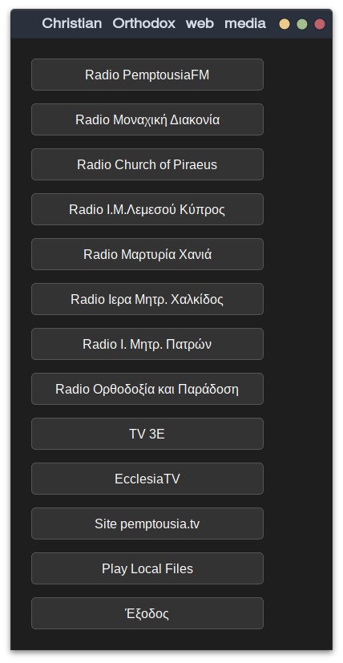

## Christian Orthodox web media <br>
Supported media players:
1. Totem
2. mpv
3. QMPlay2
4. Audacious



### requires:
1. Python3
2. Totem or mpv or vlc or QMPlay2

#### Python3 requitments:
```
pip install PyQt5
```

### Installation
Copy paste in your terminal following command and hit enter.
```
wget -q --show-progress -c https://raw.githubusercontent.com/rizitis/orthodox_web-media/main/install.sh && chmod +x install.sh && sudo ./install.sh
```

### Uninstall
```
sudo rm -r /opt/*_orthodox.py /usr/share/applications/*_orthodox.desktop  /usr/share/orthodox_web-media
```
